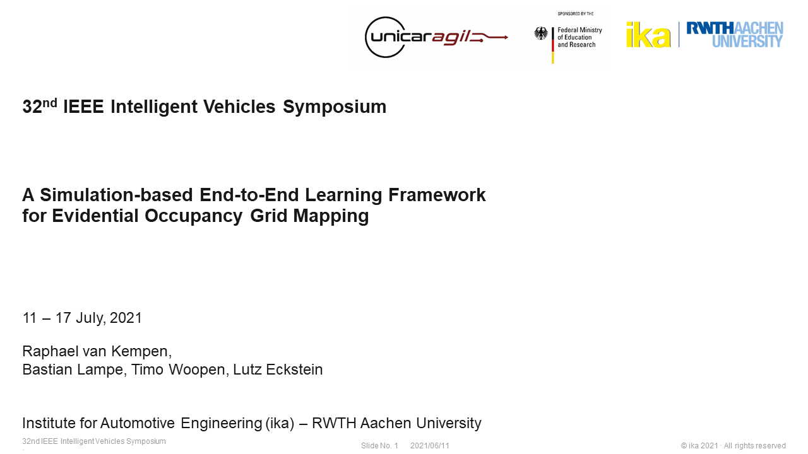

# EviLOG: Evidential Lidar Occupancy Grid Mapping

This repository provides the dataset as well as the training pipeline that was used in our paper:

[](https://www.youtube.com/watch?v=BGbMvHOksBI)

> **A Simulation-based End-to-End Learning Framework for Evidential Occupancy Grid Mapping**
> ([arXiv](https://arxiv.org/abs/2102.12718))  
>
> [Raphael van Kempen](https://www.ika.rwth-aachen.de/en/institute/staff/raphael-van-kempen-msc.html), [Bastian Lampe](https://www.ika.rwth-aachen.de/en/institute/staff/bastian-lampe-m-sc.html), [Timo Woopen](https://www.ika.rwth-aachen.de/en/institute/management/timo-woopen-msc.html), and [Lutz Eckstein](https://www.ika.rwth-aachen.de/en/institute/management/univ-prof-dr-ing-lutz-eckstein.html)  
> [Institute for Automotive Engineering (ika), RWTH Aachen University](https://www.ika.rwth-aachen.de/en/)
>
> _**Abstract**_ —  Evidential  occupancy  grid  maps  (OGMs)  are  a popular  representation  of  the  environment  of  automated  vehicles.   Inverse   sensor   models   (ISMs)   are   used   to   compute OGMs from sensor data such as lidar point clouds. Geometric ISMs  show  a  limited  performance  when  estimating  states  in unobserved  but  inferable  areas  and  have  difficulties  dealing with   ambiguous   input.   Deep   learning-based   ISMs   face   the challenge of limited training data and they often cannot handle uncertainty  quantification  yet.  We  propose  a  deep  learning-based framework for learning an OGM algorithm which is both capable of quantifying uncertainty and which does not rely on manually labeled data. Results on synthetic and on real-world data  show  superiority  over  other  approaches.

[](https://www.youtube.com/watch?v=lumNOMzdVKc)

We hope our paper, data and code can help in your research. If this is the case, please cite:

```
@misc{vankempen2021simulationbased,
      title={A Simulation-based End-to-End Learning Framework for Evidential Occupancy Grid Mapping}, 
      author={Raphael van Kempen, Bastian Lampe, Timo Woopen and Lutz Eckstein},
      year={2021},
      eprint={2102.12718},
      archivePrefix={arXiv},
      primaryClass={cs.RO}
}
```

## Content

- [Installation](#installation)
- [Data](#data)
- [Training](#training)

## Installation

We suggest to create a new **[conda](https://docs.conda.io/) environment** with all required packages. This will automatically install the GPU version of TensorFlow with CUDA and cuDNN if an NVIDIA GPU is available.

```bash
# EviLOG/
conda env create -f environment.yml
```

<u>Alternatively</u>, it is possible to install all package dependencies in a **Python 3.7** environment (e.g. by using _virtualenv_) with _pip_. Note that *CMake* must be installed to build the `point-pillars` package.

```bash
# EviLOG/
pip install -r requirements.txt
```


## Data

We provide all data that is required to reproduce the results in our paper. The *EviLOG* dataset comprises:

- **Synthetic training and validation data** consisting of lidar point clouds (as *pcd* files) and evidential occupancy grid maps (as *png* files)
  - 10.000 training samples
  - 1.000 validation samples
  - 100 test samples
- **Real-world input data** that was recorded with a *Velodyne VLP32C* lidar sensor during a ~9 minutes ride in an urban area (5.224 point clouds).

We are very interested in the impact of our provided dataset. Please fill out the **[dataset request form](https://www.unicaragil.de/en/evilog)** and we will send you a download link that is valid for 24 hours.

_**Note**: Download size is approximately 6.8 GB, uncompressed size is approximately 11.8 GB._

Put the downloaded tar archive into the [data](./data) folder and extract it:

```bash
# EviLOG/data/
tar xvf EviLOG_2021.tar.gz
```

## Training

Use the scripts [model/train.py](model/train.py), [model/evaluate.py](model/evaluate.py), and [model/predict.py](model/predict.py) to train a model, evaluate it on validation data, and make predictions on a testing dataset or the provided real-world input point clouds.

Input directories, training parameters, and more can be set via CLI arguments or in a config file. Run the scripts with `--help`-flag or see one of the provided exemplary config files for reference.

### Training

Start training the model by passing the provided config file [model/config.yml](model/config.yml).

```bash
# EviLOG/model/
export TF_FORCE_GPU_ALLOW_GROWTH=true  # try this if cuDNN fails to initialize
./train.py -c config.yml
```

You can visualize training progress by pointing *TensorBoard* to the output directory (`model/output` by default). Training metrics will also be printed to `stdout`.

### Evaluation

Before evaluating your trained model on the test data, set the parameter `model-weights` to point to the `best_weights.hdf5` file in the `Checkpoints` folder of its model directory.

```bash
# EviLOG/model/
./evaluate.py -c config.yml --input-validation ../data/input_test --label-validation ../data/label_test --model-weights output/<YOUR-TIMESTAMP>/Checkpoints/best_weights.hdf5
```

The evaluation results will be exported to the `Evaluation` folder in your model directory. This also comprises a comparison between occupancy grid maps predicted by the neural network and grid maps created using a simple geometric inverse sensor model.

**Left**: Input lidar point cloud. **Middle**: baseline OGM created by geometric ISM. **Right**: OGM predicted by deep ISM


### Testing

To actually see the predictions your network makes, try it out on unseen input point clouds, such as the provided test data or real-world input point clouds. The predicted occupancy grid maps are exported to the directory specified by the parameter `output-dir-testing`.

Prediction using **synthetic test data**:

```bash
# EviLOG/model/
./predict.py -c config.yml --model-weights output/<YOUR-TIMESTAMP>/Checkpoints/best_weights.hdf5 --prediction-dir output/<YOUR-TIMESTAMP>/Predictions
```

Prediction using **real-world input point clouds**:

```bash
# EviLOG/model/
./predict.py -c config.yml --input-testing ../data/input_real --model-weights output/<YOUR-TIMESTAMP>/Checkpoints/best_weights.hdf5 --prediction-dir output/<YOUR-TIMESTAMP>/Predictions-Real
```

## Acknowledgement

>This research is accomplished within the project ”UNICARagil” (FKZ 16EMO0289). We acknowledge the financial support for the project by the Federal Ministry of Education and Research of Germany (BMBF).
