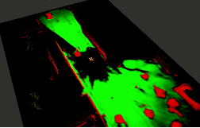
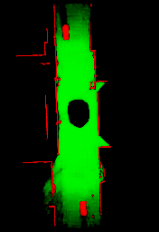

#  Deep Lidar Grid Mapping



This repository provides the dataset as well as the training pipeline that can be used to reproduce the results presented in our paper:

> **A Simulation-based End-to-End Learning Framework for Evidential Occupancy Grid Mapping**
> ([arXiv](https://arxiv.org/abs/2102.12718))  
>
> [Raphael van Kempen](https://www.ika.rwth-aachen.de/en/institute/staff/raphael-van-kempen-msc.html), [Bastian Lampe](https://www.ika.rwth-aachen.de/en/institute/staff/bastian-lampe-m-sc.html), [Timo Woopen](https://www.ika.rwth-aachen.de/en/institute/management/timo-woopen-msc.html), and [Lutz Eckstein](https://www.ika.rwth-aachen.de/en/institute/management/univ-prof-dr-ing-lutz-eckstein.html)  
> [Institute for Automotive Engineering (ika), RWTH Aachen University](https://www.ika.rwth-aachen.de/en/)
>
> _**Abstract**_ —  Evidential  occupancy  grid  maps  (OGMs)  are  a popular  representation  of  the  environment  of  automated  vehicles.   Inverse   sensor   models   (ISMs)   are   used   to   compute OGMs from sensor data such as lidar point clouds. Geometric ISMs  show  a  limited  performance  when  estimating  states  in unobserved  but  inferable  areas  and  have  difficulties  dealing with   ambiguous   input.   Deep   learning-based   ISMs   face   the challenge of limited training data and they often cannot handle uncertainty  quantification  yet.  We  propose  a  deep  learning-based framework for learning an OGM algorithm which is both capable of quantifying uncertainty and which does not rely on manually labeled data. Results on synthetic and on real-world data  show  superiority  over  other  approaches.

We hope our paper, data and code can help in your research. If this is the case, please cite:
```
@misc{vankempen2021simulationbased,
      title={A Simulation-based End-to-End Learning Framework for Evidential Occupancy Grid Mapping}, 
      author={Raphael van Kempen, Bastian Lampe, Timo Woopen and Lutz Eckstein},
      year={2021},
      eprint={2102.12718},
      archivePrefix={arXiv},
      primaryClass={cs.RO}
}
```
## Content

- [Repository Structure](#repository-structure)
- [Installation](#installation)
- [Data](#data)
- [Training](#training)

## Repository Structure

```
deep_lidar_grid_mapping
├── data                        # where our synthetic datasets are downloaded to by default  
└── model                       # training scripts and configurations 
```

## Installation

We suggest to setup a **Python 3.7** virtual environment (e.g. by using _virtualenv_ or _conda_). Inside the virtual environment, users can then use _pip_ to install all package dependencies. The most important packages are _TensorFlow 2.1_
```bash
pip install -r requirements.txt
```

## Data

We provide two synthetic datasets, which can be used to train the neural networks. The datasets are hosted in the [Cam2BEV Data Repository](https://gitlab.ika.rwth-aachen.de/cam2bev/cam2bev-data). Both datasets were used to produce the results presented in our paper:
- [*Dataset 1_FRLR*](https://gitlab.ika.rwth-aachen.de/cam2bev/cam2bev-data/-/tree/master/1_FRLR): images from four vehicle-mounted cameras, ground-truth BEV image centered above the ego vehicle
- [*Dataset 2_F*](https://gitlab.ika.rwth-aachen.de/cam2bev/cam2bev-data/-/tree/master/2_F): images from one frontal vehicle camera; ground-truth BEV image left-aligned with ego vehicle

For more information regarding the data, please refer to the [repository's README](https://gitlab.ika.rwth-aachen.de/cam2bev/cam2bev-data).

Both datasets can easily be downloaded and extracted by running the provided download script:
```bash
./data/download.sh
```

_**Note**: Download size is approximately 3.7GB, uncompressed size of both datasets is approximately 7.7GB._

## Training

Use the scripts [model/train.py](model/train.py), [model/evaluate.py](model/evaluate.py), and [model/predict.py](model/predict.py) to train a model, evaluate it on validation data, and make predictions on a testing dataset.

Input directories, training parameters, and more can be set via CLI arguments or in a config file. Run the scripts with `--help`-flag or see one of the provided exemplary config files for reference. We provide config files for either one of the networks and datasets:
- [model/config.1_FRLR.deeplab-mobilenet.yml](model/config.1_FRLR.deeplab-mobilenet.yml)

The following commands will guide you through training _uNetXST_ on _dataset 1_FRLR_.

### Training

Start training _uNetXST_ by passing the provided config file [model/config.1_FRLR.unetxst.yml](model/config.1_FRLR.unetxst.yml). Training will automatically stop if the MIoU score on the validation dataset is not rising anymore.

```bash
cd model/
```
```bash
./train.py -c config.1_FRLR.unetxst.yml
```

You can visualize training progress by pointing *TensorBoard* to the output directory (`model/output` by default). Training metrics will also be printed to `stdout`.

### Evaluation

Before evaluating your trained model, set the parameter `model-weights` to point to the `best_weights.hdf5` file in the `Checkpoints` folder of its model directory. Then run evaluation to compute a confusion matrix and class IoU scores.

```bash
./evaluate.py -c config.1_FRLR.unetxst.yml --model-weights output/<YOUR-TIMESTAMP>/Checkpoints/best_weights.hdf5
```

The evaluation results will be printed at the end of evaluation and also be exported to the `Evaluation` folder in your model directory.

### Testing

To actually see the predictions your network makes, try it out on unseen input images, such as the validation dataset. The predicted BEV images are exported to the directory specified by the parameter `output-dir-testing`.

```bash
./predict.py -c config.1_FRLR.unetxst.yml --model-weights output/<YOUR-TIMESTAMP>/Checkpoints/best_weights.hdf5 --prediction-dir output/<YOUR-TIMESTAMP>/Predictions
```
